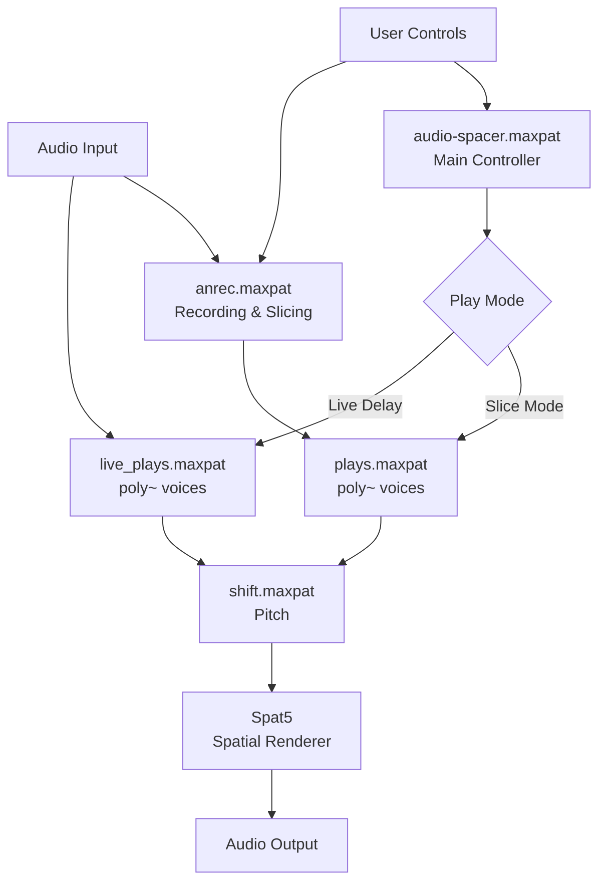

# Architecture Guide

Audio-Spacer is a modular Max/MSP system for real-time spatial audio performance with recording, slicing, and dynamic processing.

## Core Components

### audio-spacer.maxpat (Main Controller)
- Central hub for UI and parameter routing
- Manages recording state, playback modes, and global settings
- Coordinates communication between sub-patchers via send/receive
- Houses presentation interface

### anrec.maxpat (Recording/Slicing)
- Records audio to buffer
- FluCoMa onset detection (automatic slicing)
- Manual slice marking via spacebar
- Outputs slice positions for playback formatting

### plays.maxpat (Slice Playback)
- Polyphonic voices via `poly~` for multiple simultaneous slices
- Plays buffer slices using `groove~`
- Receives slice indices from sequencer
- Applies envelope shaping
- Routes to pitch processing
- Applies spatial location 

### live_plays.maxpat (Live Delay)
- Polyphonic voices via `poly~` for spatial delay
- Bypasses buffer for direct input processing
- Tempo-synced delay
- Same spatial/pitch capabilities without recording

### shift.maxpat (Pitch Processing)
- Pitch shifting via `gizmo~`
- Manual transposition (octaves, semitones, cents)
- Random overtone series from lookup table
- LFO modulation (±35 cents @ 0.5Hz)
- **Position Generation**: `get_positions.js` parses markers UI dictionary and sends locations, or random positions generated
- **Spat5 Renderer**: Multi-channel spatial audio (binaural/4ch/8ch)
- **Reverb**: Optional `nw.gverb~` processing

### JavaScript Modules
- `create_slices.js`: Transforms marker positions from samples to ms slices ready for playback
- `get_positions.js`: Parses markers UI dictionary and sends marker locations as a list
- `set_picker_size.js`: Changes picker matrixctrl layout to be proportional based on slice count
- `hoverbutton.js`: Button with hover effect for better UI feedback

## Data Flow

**Recording**: Audio → anrec → Buffer + Onset Detection → create_slices.js → Playback-ready slices

**Playback**: Sequencer → plays → shift → get_positions.js → Spat5 → Output

**Control**: User input → audio-spacer → send/receive → Sub-patchers

## External Dependencies

- **FluCoMa**: Onset detection (`fluid.noveltyslice~`, `fluid.onsetslice~`)
- **Spat5**: Multi-channel spatial rendering
- **nw.gverb~**: Reverb processing

## System Flow

